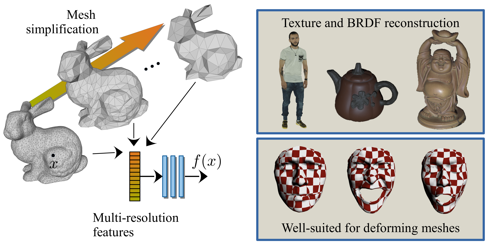

<h2 align="center">MeshFeat: Multi-Resolution Features for Neural Fields on Meshes</h2>

<p align="center">
    <a href="https://maharajamihir.github.io/">Mihir Mahajan</a><sup>1*</sup> &emsp;
    <a href="https://cvg.cit.tum.de/members/hofherrf">Florian Hofherr</a><sup>1,2*</sup> &emsp;
    <a href="https://vision.in.tum.de/members/cremers">Daniel Cremers</a><sup>1,2</sup> &emsp;
</p>

<p align="center">
    <sup>*</sup>equal contribution&emsp;&emsp;&emsp;
</p>

<p align="center">
    <sup>1</sup>Technical University of Munich&emsp;&emsp;
    <sup>2</sup>Munich Center for Machine Learning<br>
</p>

<p align="center">
    European Conference on Computer Vision (ECCV) 2024, Milan, Italy
</p>

<p align="center">
<a href="https://maharajamihir.github.io/MeshFeat/">Project Page</a> |
<a href="https://arxiv.org/abs/2407.13592">arXiv</a>
</p>

<p>&nbsp;</p>


<p align="justify"><sub>MeshFeat is a parametric encoding strategy for neural fields on meshes. 
We propose a multi-resolution strategy based on mesh simplification to enhance the efficiency of the encoding. Our approach allows for much smaller MLPs than previous frequency-based encodings, resulting in significantly faster inference times.
We evaluate the method for texture reconstruction and BRDF estimation and demonstrate, that the encoding is well suited to represent signals on deforming meshes.</sub></p>

<p>&nbsp;</p>

## Abstract
Parametric feature grid encodings have gained significant attention as an encoding approach for neural fields since they allow for much smaller MLPs which decreases the inference time of the models significantly.

In this work, we propose MeshFeat, a parametric feature encoding tailored to meshes, for which we adapt the idea of multi-resolution feature grids from Euclidean space. We start from the structure provided by the given vertex topology and use a mesh simplification algorithm to construct a multi-resolution feature representation directly on the mesh.

The approach allows the usage of small MLPs for neural fields on meshes, and we show a significant speed-up compared to previous representations while maintaining comparable reconstruction quality for texture reconstruction and BRDF representation. Given its intrinsic coupling to the vertices, the method is particularly well-suited for representations on deforming meshes, making it a good fit for object animation.

## Work with MeshFeat 

### Data
The data for our experiments can be downloaded using the following commands

```bash
# download the data for the texture reconstruction experiments (Sec 4.1)
./src/data/download_texture_dataset.sh

# download the data for the mesh deformation experiments (Sec 4.3)
./src/data/download_deformation_data.sh

# download the data for the BRDF estimation experiments (Sec 4.4)
./src/data/download_diligentMV.sh
```

### Installation 
To run MeshFeat, we recommend creating a conda environment and downloading the dependencies in there
```bash
conda create -n meshfeat python=3.10
conda activate meshfeat
pip install -r requirements.txt
pip install pyembree # fails if downloaded through requirements.txt for some reason
```

### Texture Reconstruction from Multi-View Images
You can use MeshFeat for Texture Reconstruction from Multi-View Images as outlined in Sec 4.1. 
Here we guide you through the experiments pipeline for the human object. To run the experiments on the cat object, simply change the config file.

```bash
CONFIG_FILE=config/texture/human/meshFeat_human_feat_dim_4.yaml
```

#### Preprocessing
```bash
python src/data/preprocess_dataset.py --config_path $CONFIG_FILE --split train
python src/data/preprocess_dataset.py --config_path $CONFIG_FILE --split val 
```

To run [INF](https://arxiv.org/abs/2203.07967), you will also need to preprocess the eigenfunctions:
```bash
# analogous for the cat object by replacing the arguments
python src/other_methods/preprocess_eigenfunctions.py data/preprocessed/human_efuncs data/raw/human/RUST_3d_Low1.obj 4096
```
*Note*: Please note that the preprocessing of the eigenfunctions may take hours to complete!

#### Training 
Train the model. Should approx. take an hour. 
```bash
python src/models/train.py --config_file $CONFIG_FILE
```
Note, that logs will be uploaded to wandb. To turn off this behavior, run `wandb diabled` in your terminal. 

#### Render views 
Render views to qualitatively evaluate the models reconstruction quality.
```bash
python src/visualization/render_view.py --config_path $CONFIG_FILE
```

#### Run experiments
Run the experiments and measure the speed. Output should be in the results_texture directory.
```bash
python src/experiments/experiments.py --config_path $CONFIG_FILE --test_speed
```

### BRDF estimation

You can use MeshFeat to reconstruct the Disney BRDF from multi-view images with calibrated lighting, as outlined in Sec 4.4. 

#### Data

The experiments are conducted on the [DiLiGenT-MV real-world dataset](https://sites.google.com/site/photometricstereodata/mv). You can use our provided download script, which also downloads the simplified meshes (see Sec B.2 in the supplementary material).

```bash
./src/data/download_diligentMV.sh
```

#### Training

You can train the models by running:

```bash
python src/models/train_brdf.py --config_file <CONFIG_FILE> --object <OBJECT>
```

Here, specify one of the config files in `config/brdf` and choose one of the objects from the DiLiGenT-MV dataset: `['bear', 'buddha', 'cow', 'pot2', 'reading']`.
The results will be stored in a folder `results_brdf`.

*Note*: To speed up training, the number of epochs can be reduced to about 100, which produces nearly identical results.

#### Preprocessing

The preprocessing of the data is handled during the (first) loading of the data. This includes the computation of the LBO eigenfunction (only for [INF](https://arxiv.org/abs/2203.07967)) and the computation of ray-mesh intersections and shadow maps. The results of the preprocessing will be stored in a `_precomputed_quantities` folder inside the DiLiGenT-MV data folder. Preprocessing only occurs during the first training run; after that, the precomputed quantities are loaded.

*Note*: Please note that the preprocessing of the eigenfunctions may take hours to complete!

## Citation

```
@inproceedings{mahajan2024meshFeat,
    author = {M Mahajan and F Hofherr and D Cremers},
    title = {MeshFeat: Multi-Resolution Features for Neural Fields on Meshes},
    booktitle = {European Conference on Computer Vision (ECCV)},
    year = {2024},
    eprint = {2407.13592},
    eprinttype = {arXiv},
}
``` 